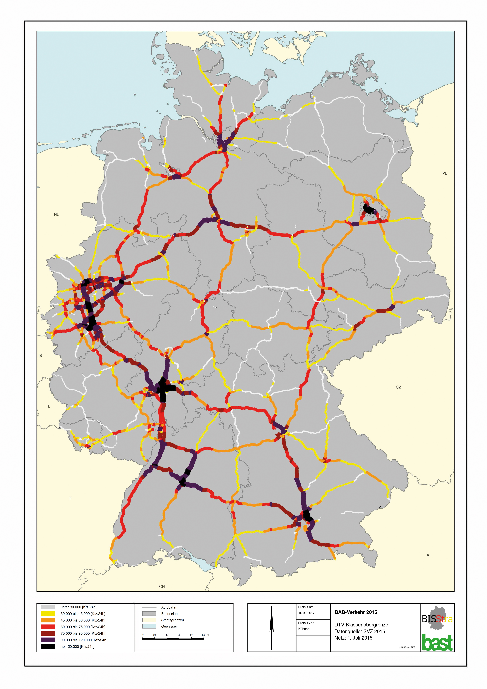

```{r setup, include=FALSE}
knitr::opts_chunk$set(echo = TRUE, message = FALSE,
                      warning = FALSE)
library(tidyverse)
library(lubridate)
library(tidymodels)
library(skimr)
library(patchwork)
library(janitor)
library(vembedr)
library(ISLR)
library(ISLR2)
library(discrim)
library(poissonreg)
library(corrr)
library(klaR)
library(readr)
library(corrplot)
library(tune)
library(ggplot2)
library(tree)
library(rpart)
library(rpart.plot)
```

## Introduction
The purpose of this project is to generate a model that will be able to predict the price of an electric vehicle based on the features that vehicle comes with.

### Electric Cars
An electric car is a car that does not run on a petrol engine but rather runs on an electric battery. Some benefits to owning an electric car are that the car is quieter, no exhaust emissions, and low maintenance costs. Electric cars are becoming increasingly popular, due to the rise of gas prices, and the advancement in technology. The problem with electric cars before was that they were too expensive, they couldn't travel far, and there weren't many places to charge your vehicle. Most electric cars do not suffer from these problems anymore. Therefore, there is more reason to purchase an electric car.
```{r}
embed_youtube("FDTf2d47P4A")
```
### How my model can be helpful
This model can be helpful by helping customers choose the features they want in their car and getting an estimated price based on what they chose. Another way they can use the model is if they have a specific budget for their electric car, then they can see what options are available to them.

### Reading in the dataset
```{r}
electric_cars <- read.csv("ElectricCarData_Clean.csv")
head(electric_cars)
# Cleaning the names and deselecting the variable "segment"
electric_cars$FastCharge_KmH <- as.numeric(electric_cars$FastCharge_KmH) 
electric_cars$AccelSec <- as.numeric(electric_cars$AccelSec)
electric_cars <- electric_cars %>%
  clean_names()
head(electric_cars) # names are cleaned up
```

### An overview of the dataset
The dataset I am using is from the website Kaggle. This dataset contains some variables that are important to a customer looking to buy an electric vehicle.
The variables in this dataset are as follows
- ```Brand```: The brand of the vehicle
- ```Model```: The model of the vehicle
- ```AccelSec```: The acceleration of the vehicle from 0-100 (km/h)
- ```TopSpeed_KmH```: The top speed of the vehicle (km/h)
- ```Range_Km```: The range of the vehicle on a full charge (km)
- ```Efficiency_WhKm```: The efficiency of the electric vehicle in watts per hour per kilometer (wh/km)
- ```FastCharge_KmH```: The charging rate of an electric car in kilometer per hour (km/h)
- ```RapidCharge```: If the car has the option of rapidcharge. Rapidcharge is a faster charge rate than the typical charging rate
- ```PowerTrain```: If the car has front, rear, or all-wheel drive
- ```PlugType:``` The type of plug the electric vehicle uses
- ```BodyStyle```: The type of body style or car style the vehicle is
- ```Segment```: The market segment the car is in
- ```Seats```: The amount of seats the vehicle holds
- ```PriceEuro```: The price of the vehicle before any tax incentives

## Important factors to Customers
As a person who's family currently owns an electric car, there are some key aspects that are important to a customer when finding the right electric car for them. Depending on a person's environment, needs, and wants, will help decide on what electric car would be perfect for them. 

### Acceleration & Top Speed
The acceleration of a vehicle could be important to customers who live in an environment with many hills and inclines. Another reason why a customer may be interested in a higher acceleration car is if they want a more "exciting" drive. A car with high acceleration will give the vehicle a more sportier feel.

The top speed of a vehicle could be important to a customer if they have a place where they could take advantage of the car's top speed. A place could be the Autobahn. The Autobahn is a freeway in Germany does not have any speed limits in some area. So a high top speed vehicle would benefit here.

{width="196"}

Top Speed and Acceleration usually seem to have some type of correlation with each other in gas powered vehicles. Usually if a car has a high top speed, they usually have a lower 0-100kmh time.
```{r}
plot(electric_cars$top_speed_km_h,electric_cars$accel_sec,  pch = 19, col = "lightblue", xlab="Top Speed (Kmh)", ylab = "Acceleration (0-100 kmh)", main = "Correlation between Acceleration and Top Speed", xlim = c(0,450), ylim = c(0, 25),)
# Regression line
abline(lm(electric_cars$accel_sec ~ electric_cars$top_speed_km_h), col = "red", lwd = 3)
# Pearson correlation
text(paste("Correlation:", round(cor(electric_cars$top_speed_km_h, electric_cars$accel_sec), 2)), x = 350, y = 20)
```

Based on the graph we can see that acceleration and top speed have a relatively strong negative correlation. Acceleration and Top Speed have a correlation of -0.79. From this graph we can say that the higher a top speed an electric car has, the lower 0-100kmh time.

### Range, fast charge, and rapid charge.
Out of all the variables of the electric car, I believe this is to be the most important variable of them all. Range tells how far the vehicle can travel before needing to be recharged. Having a shorter range on car can significantly decrease the amount of places the car can travel and how long it will take to get to each destination (due to having to recharge more often). At this period of time (2022), there are not as many charging stations as gas stations. Therefore, it is very important to know where all the nearest charging stations are when traveling, or else it will result in the car running out of electricity.

Going off charging stations, a faster charger would benefit. The benefit of gas cars over electric cars are that for a gas powered car, it takes a few minutes to refill. This is compared to electric cars that may take up to an hour or more to be completely charged. However, some cars have  fast charging or even better rapid charging. This can get the electric cars to 80% charge in just 10-15 minutes.
```{r}
embed_youtube("OpTOKKKGWV8")

electric_cars %>%
  ggplot(aes(x = rapid_charge, colour = rapid_charge)) + geom_bar()

electric_cars %>%
  ggplot(aes(x = rapid_charge, y = range_km, colour = rapid_charge)) + geom_boxplot()

ggplot(electric_cars, aes(x=range_km, y=fast_charge_km_h, colour = rapid_charge)) + geom_point() + facet_wrap( ~ rapid_charge)

sum(is.na(electric_cars$fast_charge_km_h)) 
```
Based on our graphs we can see that there are no observations in this dataset that do not have a rapid charge. However there are 5 cars in this dataset that do not have rapid charge. The graph tells us that if the car does not have rapid charge, then they also do not have fast_charge_kmh. These cars will most likely not sell as well as the vehicles with rapid charge. We can see that the cars with no rapid charge do not have a high range. The cars that do have rapid charge have a longer range and a faster charge rate. There also seems to be a positive correlation between range and fast charging. We can conclude that vehicles without rapid charging do not have a far range. We can also conclude that the faster the charger you have, the longer range your electric will go.

### Price
Of course price is truly important to customers. An electric car can contain all these cool features, but if the price is completely overpriced then it would not be worth it. Price is a key factor for everything we purchase. We buy things that we feel is worth the price. No matter how good an object it is, we always end up buying that item if the price is reasonable. This is the reason why I decided to make price my response variable in this project.
```{r}
ggplot(electric_cars, aes(price_euro)) +
   geom_histogram(bins = 70, color = "red") +
   labs(title = "Range of Prices")
```
Based on the plot we can say that the price of the electric vehicles from this dataset, mainly ranges from 0 to 80,000. The vehicles that are above this range are most likely luxurious electric vehicles or high-end sport electric sport cars. The cars that are within this range are most likely efficiently friendly vehicles.

## Prepearation for modeling
The following models conducted were done in this order and procedure:
1. Building the model
2. Running the model
3. Analyzing the results of the model

### Splitting the data
```{r}
electric_cars <- electric_cars %>%
  mutate(brand = factor(brand)) %>%
  mutate(rapid_charge = factor(rapid_charge)) %>%
  mutate(power_train = factor(power_train)) %>%
  mutate(plug_type = factor(plug_type)) %>%
  mutate(body_style = factor(body_style)) %>%
  mutate(segment = factor(segment))
head(electric_cars)

set.seed(12)
ec_split <- electric_cars %>%
  initial_split(prop = 0.75, strata = "price_euro")

ec_train <- training(ec_split)
dim(ec_train) #75
ec_test <- testing(ec_split)
dim(ec_test) #28
```

### Finding correlations
```{r}
cor_ec <- ec_train %>%
  select_if(is.numeric) %>%
  correlate()
rplot(cor_ec)
cor_ec %>%
  stretch() %>%
  ggplot(aes(x,y,fill = r)) + geom_tile() + geom_text(aes(label = as.character(fashion(r))))
```

Based on the correlation plot we can see that accel_sec has strong negative correlations with the variables: top_speed_km_h, range_km, price_euro. Top_speed_km_h has strong positive correlations with the variables: range_km, price_euro. The last correlation that is relative noting is the positive correlation between range_km and price_euro.

### Making the recipe and folds
```{r}
ec_recipe <- recipe(price_euro ~ accel_sec + top_speed_km_h + range_km + efficiency_wh_km + fast_charge_km_h + rapid_charge + power_train + plug_type + body_style + segment + seats, data = ec_train) %>%
  step_dummy(all_nominal_predictors()) %>%
  step_scale(all_predictors()) %>%
  step_normalize(all_predictors()) %>%
  step_novel(all_nominal_predictors()) %>%
  step_zv(all_nominal_predictors())
               

ec_folds <- vfold_cv(ec_train, strata = price_euro, v = 10, repeats = 5)
```

## The models

### Ridge Regression
```{r}
#Ridge Regression write eval = FALSE

ridge_spec <- linear_reg(penalty = tune(), mixture = 0) %>%
  set_mode("regression") %>%
  set_engine("glmnet")

ridge_workflow <- workflow() %>%
  add_recipe(ec_recipe) %>%
  add_model(ridge_spec)

set.seed(12)

penalty_grid <- grid_regular(penalty(range = c(1, 11)), levels = 50)
penalty_grid

tune_res <- tune_grid(
  ridge_workflow,
  resamples = ec_folds,
  grid = penalty_grid
)
tune_res

autoplot(tune_res)

collect_metrics(tune_res) %>%
arrange(-mean) %>%
  head()

best_penalty <- select_best(tune_res, metric = "rsq")
best_penalty

ridge_final <- finalize_workflow(ridge_workflow, best_penalty)
ridge_final_fit <- fit(ridge_final, data = ec_train)

Ridge_Prediction <- predict(ridge_final_fit, new_data = ec_test %>% dplyr::select(-price_euro))
Ridge_Prediction <- bind_cols(Ridge_Prediction, ec_test %>% dplyr::select(price_euro))

Ridge_Graph <- Ridge_Prediction %>%
  ggplot(aes(x=.pred, y=price_euro)) + geom_point(alpha = 1) + geom_abline(lty = 2) + theme_bw() + coord_obs_pred()

Ridge_Accuracy <- augment(ridge_final_fit, new_data = ec_test) %>%
  rsq(truth = price_euro, estimate = .pred)
```


### Lasso Regression
```{r}
#Lasso Regression

lasso_spec <-
  linear_reg(penalty = tune(), mixture = 1) %>%
  set_mode("regression") %>%
  set_engine("glmnet")

lasso_workflow <- workflow() %>%
  add_recipe(ec_recipe) %>%
  add_model(lasso_spec)

set.seed(12)

tune_res_lasso <- tune_grid(
  lasso_workflow,
  resamples = ec_folds,
  grid = penalty_grid
)
tune_res_lasso

autoplot(tune_res_lasso)

collect_metrics(tune_res_lasso) %>%
  arrange(-mean) %>%
  head()

best_penalty_lasso <- select_best(tune_res_lasso, metric = "rsq")

lasso_final <- finalize_workflow(lasso_workflow, best_penalty_lasso)
lasso_final_fit <- fit(lasso_final, data = ec_train)

Lasso_Prediction <- predict(lasso_final_fit, new_data = ec_test %>% dplyr::select(-price_euro))
Lasso_Prediction <- bind_cols(ec_train_res2, ec_test %>% dplyr::select(price_euro))

Lasso_Graph <- Lasso_Prediction %>%
  ggplot(aes(x=.pred, y=price_euro)) + geom_point(alpha=1) + geom_abline(lty = 2) + theme_bw() + coord_obs_pred()

Lasso_Accuracy <- augment(lasso_final_fit, new_data = ec_test) %>%
  rsq(truth = price_euro, estimate = .pred)
```

### Boosted Model
```{r}
boost_spec <- boost_tree() %>%
  set_engine("xgboost") %>%
  set_mode("regression")

boost_wf <- workflow() %>%
  add_model(boost_spec %>%
  set_args(trees = tune())) %>%
  add_recipe(ec_recipe)

set.seed(12)

boost_grid <- grid_regular(trees(range = c(10, 2000)), levels = 50)

boost_tune_res <- tune_grid(
  boost_wf,
  resamples = ec_folds,
  grid = boost_grid,
)

write_rds(boost_tune_res, "Model-Results/boost_tuning.rds")

autoplot(boost_tune_res)

collect_metrics(boost_tune_res) %>% 
  arrange(-mean) %>%
  head()
best_boost_final <- select_best(boost_tune_res)
best_boost_final_model <- finalize_workflow(boost_wf, best_boost_final)
best_boost_final_model_fit <- fit(best_boost_final_model, data = ec_train)

Boost_Prediction <- predict(best_boost_final_model_fit, new_data = ec_test %>% dplyr::select(-price_euro))
Boost_Prediction <- bind_cols(Boost_Prediction, ec_test %>% dplyr::select(price_euro))

Boost_Graph <- Boost_Prediction %>%
  ggplot(aes(x=.pred, y=price_euro)) + geom_point(alpha=1) + geom_abline(lty = 2) + theme_bw() + coord_obs_pred()

Boost_Accuracy <- augment(best_boost_final_model_fit, new_data = ec_test) %>%
  rsq(truth = price_euro, estimate = .pred)
```

### Tree model
```{r}
tree_spec <-decision_tree() %>%
  set_engine("rpart")

class_tree_spec <- tree_spec %>%
  set_mode("regression")
  
class_tree_wf <- workflow() %>%
  add_model(class_tree_spec %>% set_args(cost_complexity = tune())) %>%
  add_recipe(ec_recipe)

set.seed(12)

param_grid <- grid_regular(cost_complexity(range = c(-5, 5)), levels = 50)

tune_res_tree <- tune_grid(
  class_tree_wf,
  resamples = ec_folds,
  grid = param_grid,
)

write_rds(tune_res_tree, "Model-Results/tree_tuning.rds")

autoplot(tune_res_tree)

collect_metrics(tune_res_tree) %>%
  arrange(-mean) %>%
  head()

best_complexity <- select_best(tune_res_tree)
class_tree_final <- finalize_workflow(class_tree_wf, best_complexity)
class_tree_final_fit <- fit(class_tree_final, data = ec_train)

class_tree_final_fit %>%
  extract_fit_engine() %>%
  rpart.plot()

Tree_Prediction <- predict(class_tree_final_fit, new_data = ec_test %>% dplyr::select(-price_euro))
Tree_Prediction <- bind_cols(Tree_Prediction, ec_test %>% dplyr::select(price_euro))

Tree_Graph <- Tree_Prediction %>%
  ggplot(aes(x=.pred, y=price_euro)) + geom_point(alpha=1) + geom_abline(lty = 2) + theme_bw() + coord_obs_pred()

Tree_Accuracy <- augment(class_tree_final_fit, new_data = ec_test) %>%
  rsq(truth = price_euro, estimate = .pred)
```

## Conclusions

### Comparison of the four different models:

