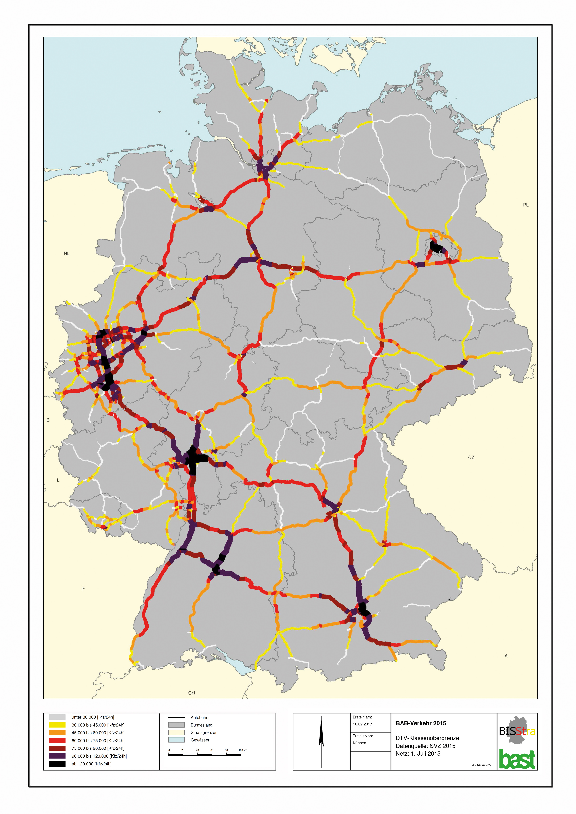
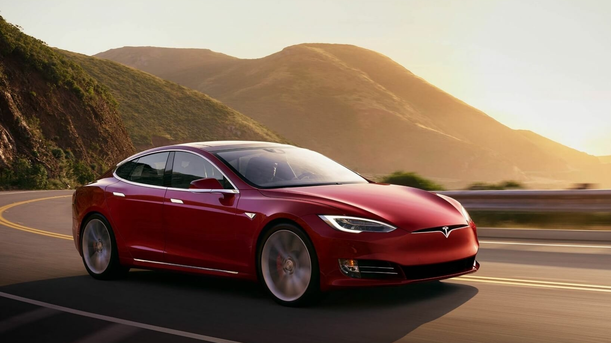

```{r setup, include=FALSE}
knitr::opts_chunk$set(echo = TRUE, message = FALSE,
                      warning = FALSE)
library(tidyverse)
library(lubridate)
library(tidymodels)
library(skimr)
library(patchwork)
library(janitor)
library(vembedr)
library(ISLR)
library(ISLR2)
library(discrim)
library(poissonreg)
library(corrr)
library(klaR)
library(readr)
library(corrplot)
library(tune)
library(ggplot2)
library(tree)
library(rpart)
library(rpart.plot)
library("ggpubr")
theme_set(
  theme_bw() +
    theme(legend.position = "top")
  )
```

## Introduction

The purpose of this project is to generate a model that will be able to predict the price of an electric vehicle based on the features that vehicle comes with.

### Electric Cars

An electric car is a car that does not run on a petrol engine but rather runs on an electric battery. Some benefits to owning an electric car are that the car is quieter, no exhaust emissions, and low maintenance costs. Electric cars are becoming increasingly popular, due to the rise of gas prices, and the advancement in technology. The problem with electric cars before was that they were too expensive, they couldn't travel far, and there weren't many places to charge your vehicle. Most electric cars do not suffer from these problems anymore. Therefore, there is more reason to purchase an electric car.
```{r}
embed_youtube("FDTf2d47P4A")
```
### How my model can be helpful

This model can be helpful by helping customers choose the features they want in their car and getting an estimated price based on what they chose. Another way they can use the model is if they have a specific budget for their electric car, then they can see what options are available to them.

### Reading in the dataset

```{r}
electric_cars <- read.csv("Data/ElectricCarData_Clean.csv")
head(electric_cars)
is.numeric(electric_cars$FastCharge_KmH)
electric_cars$FastCharge_KmH <- as.numeric(electric_cars$FastCharge_KmH) 
electric_cars <- electric_cars %>%
  clean_names()
head(electric_cars)
is.numeric(electric_cars$fast_charge_km_h)
```
I have cleaned the names and also made the variable "FastCharge_KmH" numerical instead of categorical because the values in the dataset are the charging rate of the charger from the vehicle. Therefore I believe those values should be numerical, to help improve the model's calculations.

### An overview of the dataset

The dataset I am using is from the website Kaggle. This dataset contains some variables that are important to a customer looking to buy an electric vehicle. (Can also be found in codebook)
The variables in this dataset are as follows
- ```Brand```: The brand of the vehicle
- ```Model```: The model of the vehicle
- ```AccelSec```: The acceleration of the vehicle from 0-100 (km/h)
- ```TopSpeed_KmH```: The top speed of the vehicle (km/h)
- ```Range_Km```: The range of the vehicle on a full charge (km)
- ```Efficiency_WhKm```: The efficiency of the electric vehicle in watts per hour per kilometer (wh/km)
- ```FastCharge_KmH```: The charging rate of an electric car in kilometer per hour (km/h)
- ```RapidCharge```: If the car has the option of rapidcharge. Rapidcharge is a faster charge rate than the typical charging rate
- ```PowerTrain```: If the car has front, rear, or all-wheel drive
- ```PlugType:``` The type of plug the electric vehicle uses
- ```BodyStyle```: The type of body style or car style the vehicle is
- ```Segment```: The market segment the car is in
- ```Seats```: The amount of seats the vehicle holds
- ```PriceEuro```: The price of the vehicle before any tax incentives

## Explanatory Data Analysis

Factors that could result in a person's purchase

As a person who's family currently owns an electric car, there are some key aspects that are important to a customer when finding the right electric car for them. Depending on a person's environment, needs, and wants, will help decide on what electric car would be perfect for them. 

### Acceleration & Top Speed

The acceleration of a vehicle could be important to customers who live in an environment with many hills and inclines. Another reason why a customer may be interested in a higher acceleration car is if they want a more "exciting" drive. A car with high acceleration will give the vehicle a more sportier feel.

The top speed of a vehicle could be important to a customer if they have a place where they could take advantage of the car's top speed. A place could be the Autobahn. The Autobahn is a freeway in Germany does not have any speed limits in some area. So a high top speed vehicle would benefit here.

{width="196"}

Top Speed and Acceleration usually seem to have some type of correlation with each other in gas powered vehicles. Usually if a car has a high top speed, they usually have a lower 0-100kmh time.
```{r}
plot(electric_cars$top_speed_km_h,electric_cars$accel_sec,  pch = 19, col = "lightblue", xlab="Top Speed (Kmh)", ylab = "Acceleration (0-100 kmh)", main = "Correlation between Acceleration and Top Speed", xlim = c(0,450), ylim = c(0, 25),)
# Regression line
abline(lm(electric_cars$accel_sec ~ electric_cars$top_speed_km_h), col = "red", lwd = 3)
# Pearson correlation
text(paste("Correlation:", round(cor(electric_cars$top_speed_km_h, electric_cars$accel_sec), 2)), x = 350, y = 20)
```

Based on the graph we can see that acceleration and top speed have a relatively strong negative correlation. Acceleration and Top Speed have a correlation of -0.79. From this graph we can say that the higher a top speed an electric car has, the lower 0-100kmh time.

### Range, fast charge, and rapid charge.
```{r}
embed_youtube("xnYPQjAHrQ8")
```
Out of all the variables of the electric car, I believe this is to be the most important variable of them all. Range tells how far the vehicle can travel before needing to be recharged. Having a shorter range on car can significantly decrease the amount of places the car can travel and how long it will take to get to each destination (due to having to recharge more often). At this period of time (2022), there are not as many charging stations as gas stations. Therefore, it is very important to know where all the nearest charging stations are when traveling, or else it will result in the car running out of electricity.

Going off charging stations, a faster charger would benefit. The benefit of gas cars over electric cars are that for a gas powered car, it takes a few minutes to refill. This is compared to electric cars that may take up to an hour or more to be completely charged. However, some cars have  fast charging or even better rapid charging. This can get the electric cars to 80% charge in just 10-15 minutes.
```{r}
ggplot(electric_cars, aes(x=range_km, y=fast_charge_km_h, colour = rapid_charge)) + geom_point() + facet_wrap( ~ rapid_charge)

sum(is.na(electric_cars$fast_charge_km_h))

electric_cars %>%
  ggplot(aes(x = rapid_charge, colour = rapid_charge)) + geom_bar()
```

Based on our graphs we can see that there are no observations in this dataset that do not have a rapid charge. However, when I use to check if there are any NA's in the column for fast_charge_km_h, it says there are 5. This is because the vehicles with no rapid charging are labeled as NA in the fast_charge_km_h column. We can conclude that if the vehicle does not have rapid charging, then the vehicle cannot fast charge. These cars will most likely not sell as well as the vehicles with rapid charge.
```{r}
electric_cars %>%
  ggplot(aes(x = rapid_charge, y = range_km, colour = rapid_charge)) + geom_boxplot()
```

We can see that the cars with no rapid charge do not have a high range. The cars that do have rapid charge have a longer range and a faster charge rate. There also seems to be a positive correlation between range and fast charging. We can conclude that vehicles without rapid charging do not have a far range. We can also conclude that the faster the charger you have, the farther range your electric vehicle will have.

### Price

Of course price is truly important to customers. An electric car can contain all these cool features, but if the price is completely overpriced then it would not be worth it. Price is a key factor for everything we purchase. We buy things that we feel is worth the price. No matter how good an object it is, we always end up buying that item if the price is reasonable. This is the reason why I decided to make price my response variable in this project.
```{r}
ggplot(electric_cars, aes(price_euro)) +
   geom_histogram(bins = 70, color = "red") +
   labs(title = "Range of Prices")
```

Based on the plot we can say that the price of the electric vehicles from this dataset, mainly ranges from 0 to 80,000. The vehicles that are above this range are most likely luxurious electric vehicles or high-end sport electric sport cars. The cars that are within this range are most likely efficiently friendly vehicles.

### Brand

A brand may not seem as important when looking for the perfect electric vehicle for you, but to others it may be something well considering. A few reasons why a customer may want to go for a specific brand are: the brand has a great reputation, the buyer may have bought vehicles from the brand before, or the brand gives it's buyer a type of prestige. A brand that is currently leading the electric vehicle market is Tesla. This is simply because Tesla has a premium-like quality, with the addition of multiple high-tech features such as "self-driving".

{width="220"}
```{r}
electric_cars %>%
  ggplot(aes(reorder(brand, price_euro), price_euro)) +  geom_boxplot(varwidth = TRUE) + coord_flip() + labs(subtitle = "brands",x = NULL)
```

Based on our plot we can see that the top 3 brands are Lightyear, Porsche, and Lucid. Lucid an Lightyear only make electric cars so they are not as well known. Porsche is a well-known car brand for making gasoline powered vehicles. There vehicles cost more than the average vehicle so it makes sense that Porsche is third on our plot. Tesla arrives at fifth which also makes sense since they are vehicles are closer to the more luxurious side. The bottom 3 are Sono, Smart, and SEAT. Sono and SEAT are not as well known in the automotive world. However, Smart makes small eco-friendly vehicles that are cheaper than the average vehicle therefore it makes sense that they are one of the lowest on the list.

{width="220"}

### Finding more correlations

We have found some correlations already between some variables. However, let us graph a correlation plot with the numeric predictors to see if they are any more correlations.
```{r}
cor_ec <- electric_cars %>%
  select_if(is.numeric) %>%
  correlate()
rplot(cor_ec)
cor_ec %>%
  stretch() %>%
  ggplot(aes(x,y,fill = r)) + geom_tile() + geom_text(aes(label = as.character(fashion(r))))
```

Based on the correlation plot we can see that accel_sec has strong negative correlations with the variables: top_speed_km_h, range_km, price_euro. Top_speed_km_h has strong positive correlations with the variables: range_km, price_euro. The last correlation that is relative noting is the positive correlation between range_km and price_euro.

## Prepearation for modeling

The following models conducted were done in this order and procedure:
1. Building the model
2. Running the model
3. Making predictions using the model
4. Assessing it's accuracy on the testing set

### Preparing the data

```{r}
electric_cars <- electric_cars %>%
  mutate(brand = factor(brand)) %>%
  mutate(rapid_charge = factor(rapid_charge)) %>%
  mutate(power_train = factor(power_train)) %>%
  mutate(plug_type = factor(plug_type)) %>%
  mutate(body_style = factor(body_style)) %>%
  mutate(segment = factor(segment))
head(electric_cars)
```
I mutated the variables by factoring the numerical predictors.

### Splitting the data

```{r}
set.seed(12)
ec_split <- electric_cars %>%
  initial_split(prop = 0.75, strata = "price_euro")

ec_train <- training(ec_split)
dim(ec_train) #75
ec_test <- testing(ec_split)
dim(ec_test) #28
```

I decided to split the data with a .75 proportion and I made the strata price_euro because we are trying to predict the price of a vehicle based on the other variables. After splitting the data we get 75 observations for the training set and 28 left over for the testing set.

### Making the recipe and folds

```{r}
ec_recipe <- recipe(price_euro ~ accel_sec + top_speed_km_h + range_km + efficiency_wh_km + fast_charge_km_h + rapid_charge + power_train + plug_type + body_style + segment + seats, data = ec_train) %>%
  step_dummy(all_nominal_predictors()) %>%
  step_normalize(all_predictors()) %>%
  step_novel(all_nominal_predictors()) %>%
  step_zv(all_nominal_predictors())
               

ec_folds <- vfold_cv(ec_train, strata = price_euro, v = 10, repeats = 5)
```

We made a recipe using the training set. The predictor variables we left out of the recipe are brand and model. I decided to leave them out because I wanted the prediction to be completely based on the features of the vehicle. I step_dummy()  all nominal predictors to encode them as categorical predictors. I also step_normalize() to center and scale all the predictors. I step_novel and step_zv all nominal predictors so it would assign any previously unseen factor level to a new value and to remove any variables that contain only a single value.

## The models

### Ridge Regression

```{r, message=FALSE, warning=FALSE}
ridge_spec <- linear_reg(penalty = tune(), mixture = 0) %>%
  set_mode("regression") %>%
  set_engine("glmnet")

ridge_workflow <- workflow() %>%
  add_recipe(ec_recipe) %>%
  add_model(ridge_spec)

set.seed(12)

penalty_grid <- grid_regular(penalty(range = c(1, 11)), levels = 50)
penalty_grid

tune_res <- tune_grid(
  ridge_workflow,
  resamples = ec_folds,
  grid = penalty_grid
)
tune_res

autoplot(tune_res)
```

In this step we are adding the recipe to the ridge model. We are also making the workflow and grid for the tune_grid. We use the folds we did earlier for the tune_grid also.

```{r}
collect_metrics(tune_res) %>%
arrange(-mean) %>%
  head()
```

We collect the metrics of our regression tune and look at the mean and standard error.

```{r}
best_penalty <- select_best(tune_res, metric = "rsq")
best_penalty

ridge_final <- finalize_workflow(ridge_workflow, best_penalty)
ridge_final_fit <- fit(ridge_final, data = ec_train)

Ridge_Prediction <- predict(ridge_final_fit, new_data = ec_test %>% dplyr::select(-price_euro))
Ridge_Prediction <- bind_cols(Ridge_Prediction, ec_test %>% dplyr::select(price_euro))

Ridge_Graph <- Ridge_Prediction %>%
  ggplot(aes(x=.pred, y=price_euro)) + geom_point(alpha = 1) + geom_abline(lty = 2) + theme_bw() + coord_obs_pred()

Ridge_Accuracy <- augment(ridge_final_fit, new_data = ec_test) %>%
  rsq(truth = price_euro, estimate = .pred)
```

Here we prepare the predictions, graphs, and plots, for comparison at the end.


### Lasso Regression

```{r, message=FALSE, warning=FALSE}
lasso_spec <-
  linear_reg(penalty = tune(), mixture = 1) %>%
  set_mode("regression") %>%
  set_engine("glmnet")

lasso_workflow <- workflow() %>%
  add_recipe(ec_recipe) %>%
  add_model(lasso_spec)

set.seed(12)

tune_res_lasso <- tune_grid(
  lasso_workflow,
  resamples = ec_folds,
  grid = penalty_grid
)
tune_res_lasso

autoplot(tune_res_lasso)
```

In this step we are adding the recipe to the lasso model. We are also making the workflow and grid for the tune_grid. We use the folds we did earlier for the tune_grid also. The plots does not seem to be as smooth as the ridge model.

```{r}
collect_metrics(tune_res_lasso) %>%
  arrange(-mean) %>%
  head()
```

We collect the metrics of our regression tune and look at the mean and standard error. They seem to be very similar and or not the same as the Ridge regression.

```{r}
best_penalty_lasso <- select_best(tune_res_lasso, metric = "rsq")

lasso_final <- finalize_workflow(lasso_workflow, best_penalty_lasso)
lasso_final_fit <- fit(lasso_final, data = ec_train)

Lasso_Prediction <- predict(lasso_final_fit, new_data = ec_test %>% dplyr::select(-price_euro))
Lasso_Prediction <- bind_cols(Lasso_Prediction, ec_test %>% dplyr::select(price_euro))

Lasso_Graph <- Lasso_Prediction %>%
  ggplot(aes(x=.pred, y=price_euro)) + geom_point(alpha=1) + geom_abline(lty = 2) + theme_bw() + coord_obs_pred()

Lasso_Accuracy <- augment(lasso_final_fit, new_data = ec_test) %>%
  rsq(truth = price_euro, estimate = .pred)
```

Here we prepare the predictions, graphs, and plots, for comparison at the end.

### Boosted Model
```{r, message=FALSE, warning=FALSE}
boost_spec <- boost_tree() %>%
  set_engine("xgboost") %>%
  set_mode("regression")

boost_wf <- workflow() %>%
  add_model(boost_spec %>%
  set_args(trees = tune())) %>%
  add_recipe(ec_recipe)

set.seed(12)

boost_grid <- grid_regular(trees(range = c(10, 2000)), levels = 50)

boost_tune_res <- tune_grid(
  boost_wf,
  resamples = ec_folds,
  grid = boost_grid,
)

autoplot(boost_tune_res)
```

In this step we are adding the recipe to the Boost model. We are also making the workflow and grid for the tune_grid. We use the folds we did earlier for the tune_grid also. The tree plots here seem to go straight up and then flatten out, never changing it's slope again.


```{r}
collect_metrics(boost_tune_res) %>% 
  arrange(-mean) %>%
  head()
```

We collect the metrics of our regression tune and look at the mean and standard error. The boost model seems to have a much lower mean compared to Lasso and Ridge. The boost also has a higher standard error compared to the two previous models.

```{r}
best_boost_final <- select_best(boost_tune_res)
best_boost_final_model <- finalize_workflow(boost_wf, best_boost_final)
best_boost_final_model_fit <- fit(best_boost_final_model, data = ec_train)

Boost_Prediction <- predict(best_boost_final_model_fit, new_data = ec_test %>% dplyr::select(-price_euro))
Boost_Prediction <- bind_cols(Boost_Prediction, ec_test %>% dplyr::select(price_euro))

Boost_Graph <- Boost_Prediction %>%
  ggplot(aes(x=.pred, y=price_euro)) + geom_point(alpha=1) + geom_abline(lty = 2) + theme_bw() + coord_obs_pred()

Boost_Accuracy <- augment(best_boost_final_model_fit, new_data = ec_test) %>%
  rsq(truth = price_euro, estimate = .pred)
```

Here we prepare the predictions, graphs, and plots, for comparison at the end.

### Decision - Tree model
```{r, message=FALSE, warning=FALSE}
tree_spec <-decision_tree() %>%
  set_engine("rpart")

class_tree_spec <- tree_spec %>%
  set_mode("regression")
  
class_tree_wf <- workflow() %>%
  add_model(class_tree_spec %>% set_args(cost_complexity = tune())) %>%
  add_recipe(ec_recipe)

set.seed(12)

param_grid <- grid_regular(cost_complexity(range = c(-5, 5)), levels = 50)

tune_res_tree <- tune_grid(
  class_tree_wf,
  resamples = ec_folds,
  grid = param_grid,
)

autoplot(tune_res_tree)
```

In this step we are adding the recipe to the Tree model. We are also making the workflow and grid for the tune_grid. We use the folds we did earlier for the tune_grid also. The cost_complexity parameter seems to have more similarities to the lasso plots. The reasoning is the plots are not smooth, and seem to have sudden changes of slope.

```{r}
collect_metrics(tune_res_tree) %>%
  arrange(-mean) %>%
  head()
```

We collect the metrics of our regression tune and look at the mean and standard error. The tree model has the exact same mean and standard error as the Lasso and Ridge models.

```{r}
best_complexity <- select_best(tune_res_tree)
class_tree_final <- finalize_workflow(class_tree_wf, best_complexity)
class_tree_final_fit <- fit(class_tree_final, data = ec_train)

class_tree_final_fit %>%
  extract_fit_engine() %>%
  rpart.plot()
```

The tree plot asks specific questions. These questions can only be answered yes or no. Looking at the tree plot we can see that the first question was about the accel_sec. The second line asked about the range_km. The third line asked about the accel_sec again or it asked about segment_c. Then it finally asked again about accel_sec. Going through this tree gave predictions of the car price. Looking at the plot, the model predicts:
- 9% $\approx$ 25,000
- 28% $\approx$ 34,000
- 15% $\approx$ 45,000
- 9% $\approx$ 52,000
- 19% $\approx$ 64,000
- 20% $\approx$ 108,000
```{r}
Tree_Prediction <- predict(class_tree_final_fit, new_data = ec_test %>% dplyr::select(-price_euro))
Tree_Prediction <- bind_cols(Tree_Prediction, ec_test %>% dplyr::select(price_euro))

Tree_Graph <- Tree_Prediction %>%
  ggplot(aes(x=.pred, y=price_euro)) + geom_point(alpha=1) + geom_abline(lty = 2) + theme_bw() + coord_obs_pred()

Tree_Accuracy <- augment(class_tree_final_fit, new_data = ec_test) %>%
  rsq(truth = price_euro, estimate = .pred)
```

Here we prepare the predictions, graphs, and plots, for comparison at the end.

## Conclusions

Comparison of the four different models: 
We will compare the four different models in this by these factors:
- Predictions
- Graphs
- Accuracy
Whichever model has the highest accuracy, would be the best model to predict the price of an electric car based on their features.

### Predictions

We are going to look over the first five predictions compared to the actual price of the vehicle. Note: The actual prices are the same for each model.
Ridge
```{r}
head(Ridge_Prediction)
```

Lasso
```{r}
head(Lasso_Prediction)
```

Boost
```{r}
head(Boost_Prediction)
```

Tree
```{r}
head(Tree_Prediction)
```

Looking at the predictions of each model, I would personally say that the boost model has the best predictions. I think it's predictions overall are closer to the actual value of the vehicle.

### Graphs

```{r}
figure <- ggarrange(Ridge_Graph, Lasso_Graph, Boost_Graph,Tree_Graph,
                    labels = c("Ridge", "Lasso", "Boost","Tree"),
                    ncol = 2, nrow = 2)
figure
```

In the plots the dotted line represents where the points would be if the actual price of the vehicle was the same number as the prediction. Looking at the plots I can say I would say that the Lasso and Ridge have the points closest to the dotted line meaning they most likely have the highest accuracy between the four models.

### Accuracy

```{r}
accuracy_comparisons <- bind_rows(Ridge_Accuracy, Lasso_Accuracy, Boost_Accuracy, Tree_Accuracy) %>% 
  tibble() %>% mutate(model = c("Ridge", "Lasso", "Boost", "Tree")) %>% 
  dplyr::select(model, .estimate) %>%
  arrange(.estimate)

accuracy_comparisons
```

Looking at the accuracy of the four different models we see that the Lasso model had the highest accuracy and the tree model had the lowest accuracy. Ridge was after Lasso then Boost, then finally Tree.

### Summary

Going through the dataset we found a couple of correlations between the variables. After we decided to produce four different models. These models were: Ridge, Lasso, Boost, and Tree. Analyzing the results of the models we have that Lasso had the highest predicted accuracy and Tree with the lowest predicted accuracy. I believe the reason why the tree model did poorly was because I think the tree model is more successful with categorical data. The data we used mainly consisted of numerical data. Based on this research, by using a Lasso model we can accurately predict the price of an electric vehicle about 86% of the time.

